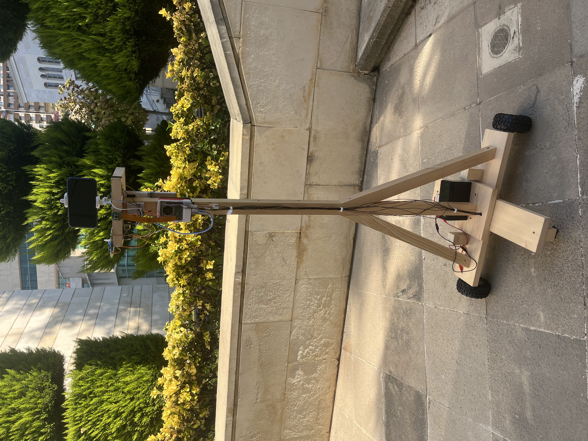
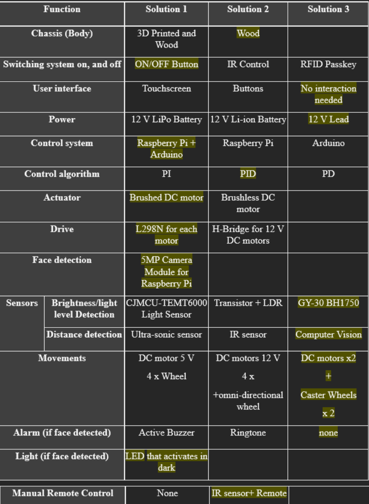
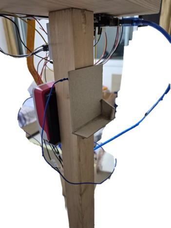
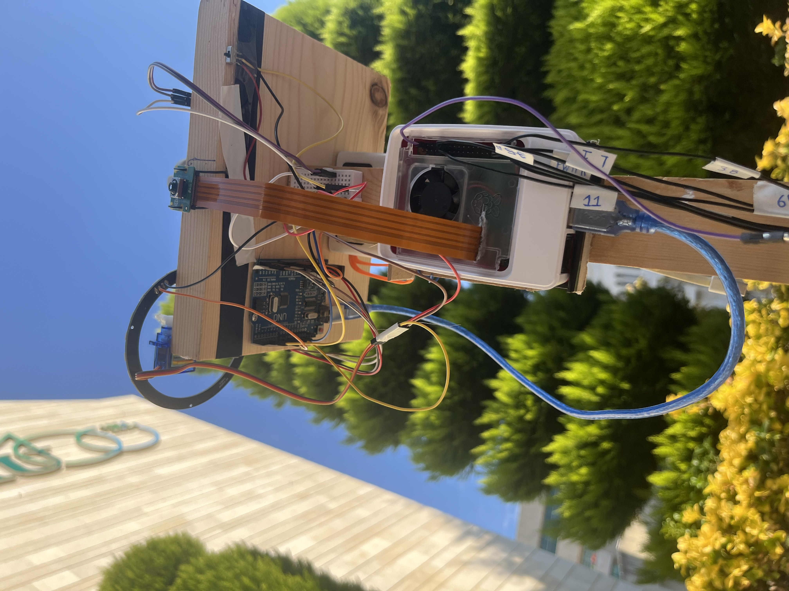
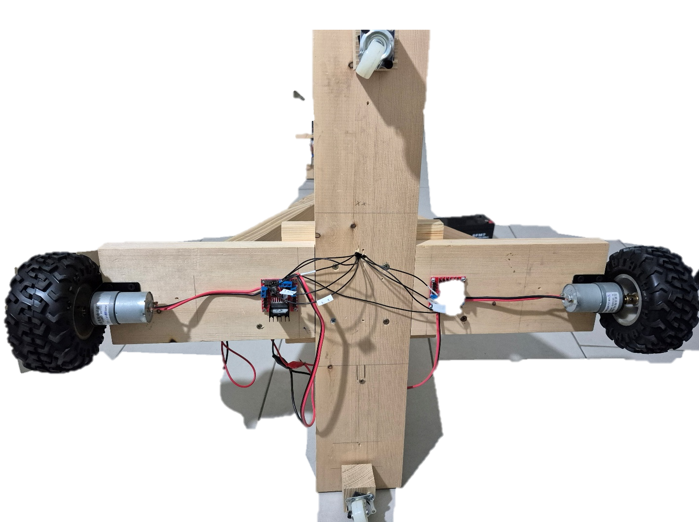
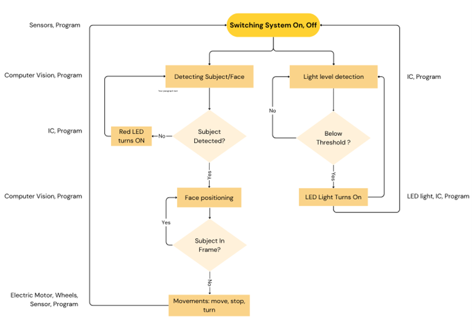


# FrameLock
## Introduction

Capturing smooth video shots is challenging, especially when filming solo. FrameLock is a lightweight autonomous mobile robot designed to act as a smart camera operator and mobile assistant, integrating real-time face tracking, automatic centering, and adaptive motion.  
This project proposes the design of a lightweight autonomous mobile robot that acts as both a smart camera operator and a mobile carrying  
assistant.
It integrates real-time face tracking, automatic centering, and smooth mobility to follow the user without any manual control.

The robot:

-   Autonomous subject tracking and centering using face recognition
-   Mobile platform capable of carrying items (equipment, tools, camera gear…)
-   Adaptive by maintaining distance & adjusting speed
-   Stable motion with PID and balanced chassis design
-   Fully standalone system that requires no intervention
-   Sleek and rigid design for portability

---

## Equipment

- MG90S servo motor
- Arduino kit remote control
- IR receiver module
- Arduino UNO R3
- Raspberry Pi 5 8GB ram
- L298N motor driver
- 37GB528 DC motor
- WS2812B RGB Neopixel LED Ring
- GY-30 BH1750 intensity light sensor
- Raspberry Pi5 official case
- Type C 5V/5A output power bank
---

## Design Summary




Our project is lightweight autonomous mobile tripod robot that can:
- Recognize authorized faces
- Choose the face to follow
- Center the face and the camera
- Maintain a certain distance between the camera and the face

---

## System Details
Our design went through many theoretical solutions and we choose an optimal solution out of them after testing in simulations which one we should use.
The solution we choose highlighted in the table:


### Design
-   **Main Body**: Constructed from wood to provide a strong yet lightweight frame, with an integrated compartment dedicated to housing the battery.
    
-   **Electronics Housing**: A custom case was fabricated for both the power bank and the Raspberry Pi 5. Reinforced cardboard was used for durability, and the case was securely mounted onto the wooden structure.
    
-   **Wiring System**: Extended custom-built wiring harnesses (female-to-male and female-to-female connectors) were created to bridge the long distance between the Raspberry Pi and the motors, ensuring reliable connectivity and flexibility in component placement.







### Circuit

**Pi5 Connections:**
- DC motor 1 + L298N motor driver 1
	- IN1: GPIO16 | pin 36
	- IN2: GPIO 17 | pin 11
	- ENB: GPI 18 | pin 12
- DC motor 2 + L298N motor driver 2
	- IN1: GPIO16 | pin 36
	- IN2: GPIO 17 | pin 11
	- ENB: GPI 18 | pin 12
- Pi camera
- Arduino | USB A port

**Arduino Connections**
- Servo motor | pin 9
- LED ring | pin 6
- IR receiver | pin 11
---

## Code 


The robot’s behavior is governed by a structured loop that integrates **IR input**, **computer vision**, and **motor control**:
### Control Logic
1.  **User Input Phase**
    -   The system waits for a command via the IR receiver, specifying which face to track.        
2.  **Search Phase**
    
    -   The robot rotates slowly on the ground, scanning the environment until the target face is detected by the camera module.     
3.  **Centering Phase**
    -   Once the face is identified, the robot continuously adjusts its orientation to align the face with the center of the camera’s field of view.
4.  **Distance Maintenance Phase**
    -   When the face is centered, the robot regulates its position to maintain a predefined distance between the camera and the subject.
    -   If the face drifts off-center, the robot re-enters the centering phase before resuming distance regulation.
 
### Note
To run the code you need to write this commands in the terminal:
1. Create a virtual environment
	```
	python3 -m venv face_rec
	```
2. Place the requirements file inside the venv you created
3. download the libraries using the requirements file
	```
	source  face_rec/bin/activate 
	pip install -r requirements.txt
	```

 ---
## Team Members
Ali Ismail - Control System, CV & Integration, Arduino Development
Farah Michael - Mechanical Design, Arduino Development
Nour Zebian - Mechanical Design, CV & Integration 

## Sources
PID Controller Library:
- Motor Speed Controller:
https://thingsdaq.org/2022/04/17/motor-speed-control-with-raspberry-pi/
- Gpiozero Extended Library:
https://github.com/EduardoNigro/Things-DAQ-Code/blob/main/Motor-Speed-Control/gpiozero_extended.py

Facial Recognition with OpenCV:
- Written Tutorial:
https://core-electronics.com.au/guides/raspberry-pi/face-recognition-with-raspberry-pi-and-opencv/
- YouTube Tutorial:
https://www.youtube.com/watch?v=3TUlJrRJUeM


